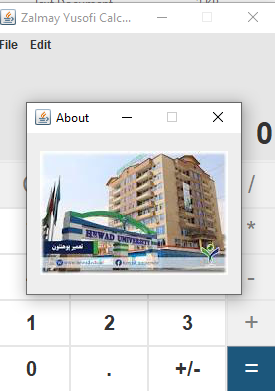
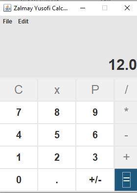
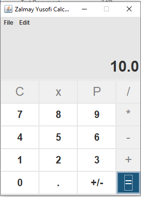
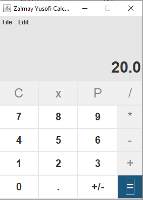
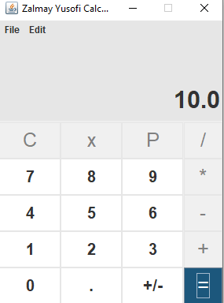
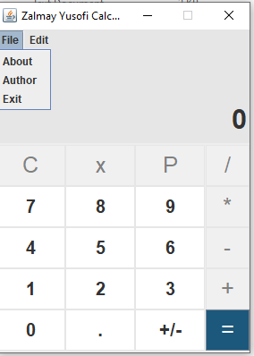
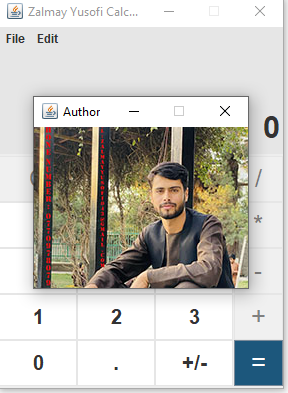

# 🧮 Java Swing Calculator


A fully functional desktop calculator built with **Java Swing**. Clean UI, responsive buttons, and support for basic arithmetic operations – perfect for demonstrating GUI development skills.

<p align="center">
  
</p>

---

## ✨ Features

| Operation | Preview |
|-----------|---------|
| **Addition** |  |
| **Subtraction** |  |
| **Multiplication** |  |
| **Division** |  |

---

## 🖼️ UI Showcase

<div align="center">
  
  
  
</div>

---

## 🛠️ Tech Stack
- **Java** (JDK 8+)
- **Swing** – GUI framework
- **NetBeans** (Optional – project files included)

---

## 📦 Download & Run (For End Users)

1. Go to the **[Releases](https://github.com/Zalmay2001/Java-Swing-Calculator/releases)** tab above.
2. Download `Calculator.jar`.
3. Double-click the file – no installation required!

---

## 🚀 Run from Source (For Developers)

If you want to compile and run the source code manually:

1. Clone the repository and navigate to the project folder:
   ```bash
   git clone https://github.com/Zalmay2001/Java-Swing-Calculator.git
   cd Java-Swing-Calculator
